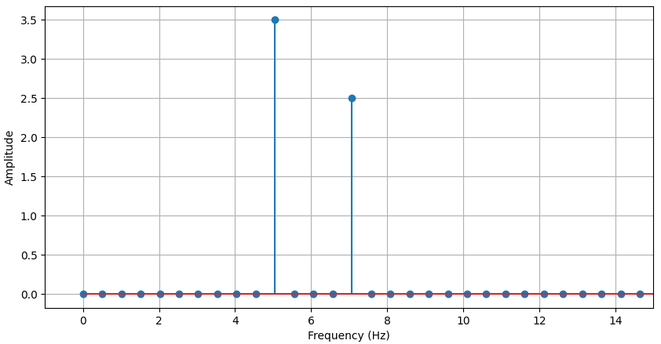

# Fourier Transform

## It is no wonder one of the most well-known algorithms for working with signals is going to be used in this project. Here I will provide an outline of what Fourier Transform is, how it works and how I am going to use it for BatSonar.

### Discrete Fourier Transform

Scroll down to the bottom to see the code in python.

For real-time signal analysis Discrete Fourier Transform may not be the exact variation of this algorithm, but understanding this will provide the foundation for working with all of them efficiently.

Another important note: I am describing here a loop-based version of DFT, which not used in practice in favor of the much faster, Fast Fourier Transform. But FFT being more complicated, I made a decision to focus on DFT, since, again, the concepts and ideas are similar. 

Still, with the help of CUDA-equipped GPUs and tools like `Cupy` - essentially, `numpy` on CUDA - and the ML framework `PyTorch`, even this basic loop-based DFT can be relatively performant.

### Goal of DFT

The goal of DFT or FFT is the same - decompose a complex signal. In literature, this is often referred to as moving a signal from time domain into frequency domain. And this is a great summary - FFT allows us to sample the signal into constituent frequencies and show their amplitude or power in the signal. This is often visualized as a stem-plot, where frequencies are on the x-axis, and amplitude or power is on the y-axis. This provides us with valuable information of the frequency content of the signal, that, in the case of analysing animal vocalizations can be a digital fingerprint of a species.

### The DFT algorithm

The algorithm consists of the following steps.

First, get a signal. A signal in our case will be a Wave file. We load it with `librosa`:

```
signal, sr = librosa.load("path")
```

Now we have the sampling rate $S_r$ and the `signal` which is represented as a one-dimensional `numpy` array, or a vector. I will refer to it further on as $\vec{sig}$ to indicate it is a vector.

A `sampling rate` $S_r$ refers to the number of samples taken on a sound signal. $S_r$ needs to follow a rule, where it has to be at least twice as high as the highest frequency in the signal to avoid `aliasing`. This is referred to as the `Nyquist frequency`.

$$
F_N = \frac{S_r}{2}
$$

We have $\vec{signal}$ and the $S_r$. The next step is to create a time vector. The length of the vector has to be at twice the $S_r$, and range from 0 to the duration of the signal $S_t$, evenly spaced.

$$
\vec{t} = \begin{bmatrix} 0  & ... & S_t\end{bmatrix}
$$
# Fourier Transform

## It is no wonder one of the most well-known algorithms for working with signals is going to be used in this project. Here I will provide an outline of what Fourier Transform is, how it works and how I am going to use it for BatSonar.

### Discrete Fourier Transform

For real-time signal analysis Discrete Fourier Transform may not be the exact variation of this algorithm, but understanding this will provide the foundation for working with all of them efficiently.

Another important note: I am describing here a loop-based version of DFT, which not used in practice in favor of the much faster, Fast Fourier Transform. But FFT being more complicated, I made a decision to focus on DFT, since, again, the concepts and ideas are similar. 

Still, with the help of CUDA-equipped GPUs and tools like `Cupy` - essentially, `numpy` on CUDA - and the ML framework `PyTorch`, even this basic loop-based DFT can be relatively performant.

### Goal of DFT

The goal of DFT or FFT is the same - decompose a complex signal. In literature, this is often referred to as moving a signal from time domain into frequency domain. And this is a great summary - FFT allows us to sample the signal into constituent frequencies and show their amplitude or power in the signal. This is often visualized as a stem-plot, where frequencies are on the x-axis, and amplitude or power is on the y-axis. This provides us with valuable information of the frequency content of the signal, that, in the case of analysing animal vocalizations can be a digital fingerprint of a species.

### The DFT algorithm

The algorithm consists of the following steps.

First, get a signal. A signal in our case will be a Wave file. We load it with `librosa`:

```
signal, sr = librosa.load("path")
```

Now we have the sampling rate $S_r$ and the `signal` which is represented as a one-dimensional `numpy` array, or a vector. I will refer to it further on as $\vec{sig}$ to indicate it is a vector.

A `sampling rate` $S_r$ refers to the number of samples taken on a sound signal. $S_r$ needs to follow a rule, where it has to be at least twice as high as the highest frequency in the signal to avoid `aliasing`. This is referred to as the `Nyquist frequency`.

$$
F_N = \frac{S_r}{2}
$$

We have $\vec{signal}$ and the $S_r$. The next step is to create a time vector. The length of the vector has to be at twice the $S_r$, and range from 0 to the duration of the signal $S_t$, evenly spaced.

$$
\vec{t} = \begin{bmatrix} 0  & ... & S_t\end{bmatrix}
$$

Now that we have $\vec{t}$, we start the loop.

Initialize a vector $\vec{dc}$, or a `numpy.zeros` of length equal the length of $\vec{t}$.

Additionally, initialize another time vector for the complex sine waves $\vec{ft}$.

$$
\vec{ft} = \frac{\begin{bmatrix} 0 & 1 & 2  & ... & len(\vec{t})\end{bmatrix}}{len(\vec{t})}
$$


As we iterate over the range $[0, len(\vec{t})]$

- Choose the current integer $i$ in the iteration as the base frequency $f$
- Create a complex sine wave using Euler's formula

$$
e^{Ik} = cos(k) + Isin(k)
$$

Remember the sine wave formula

$$
A * 2 \pi ft+\phi
$$

If we plug in this expression into Euler's formula, we get something curious

$$
e^{I2 \pi ft+\phi} = cos(2 \pi ft+\phi) + Isin(2 \pi ft+\phi)
$$

And that is the formula for the complex sine wave $\vec{csw}$. Remember $I$ is the imaginary part of a complex number. Complex numbers are a topic of their own, though. 

- Compute a dot product

$$
\mathbf{\vec{sig}} \cdot \mathbf{\vec{csw}} 
$$

- Store the dot product - called a `Fourier coefficient` - in $\vec{dc}$.


This is the end of the loop. We now have an vector $\vec{dc}$ that contains Fourier coefficients. The next task is to normalize them.

$$
\vec{dcn} = \frac{\vec{dc}}{len(\vec{t})}
$$

Otherwise we will end up with amplitudes way too large - as the loop progresses, the dot products get bigger and bigger.

Next step, compute the amplitudes. This is straightforward.

$$
\vec{A} = |\vec{dcn}| ^ 2
$$

Additionnaly, if I want to use power instead of amplitudes, I can do

$$
\vec{P} = \vec{A}^2
$$

As the final step, we generate the frequencies vector $\vec{f}$ of length $S_r$

$$
\vec{f} = \begin{bmatrix} 0 & 0.1 & 0.2 & ... & F_N\end{bmatrix}
$$

$$
|\vec{f}| = S_r
$$

That is about it. Now I can create a stem plot with `matplotlib` where $x\text{-axis}$ is $\vec{f}$ and $y\text{-axis}$ is either $\vec{P}$ or $\vec{A}$.

However, I can only use the left half of my amplitudes - because of the Nyquist rule, the other half is aliased and not really useful. Thus:

$$
\vec{A} = \vec{A}\begin{bmatrix} 0 :len(\vec{f})\end{bmatrix}
$$

The same in Python

```
plt.stem(frequencies, amplitudes[range(len(frequencies))])
```


Now that we have $\vec{t}$, we start the loop.

Initialize a vector $\vec{dc}$, or a `numpy.zeros` of length equal the length of $\vec{t}$.

Additionally, initialize another time vector for the complex sine waves $\vec{ft}$.

$$
\vec{ft} = \frac{\begin{bmatrix} 0 & 1 & 2  & ... & len(\vec{t})\end{bmatrix}}{len(\vec{t})}
$$


As we iterate over the range  

$$
[0:len(\vec{t})]
$$

- Choose the current integer $i$ in the iteration as the base frequency $f$
- Create a complex sine wave using Euler's formula

$$
e^{Ik} = cos(k) + Isin(k)
$$

Remember the sine wave formula

$$
A * 2 \pi ft+\phi
$$

If we plug in this expression into Euler's formula, we get something curious

$$
e^{I2 \pi ft+\phi} = cos(2 \pi ft+\phi) + Isin(2 \pi ft+\phi)
$$

And that is the formula for the complex sine wave $\vec{csw}$. Remember $I$ is the imaginary part of a complex number. Complex numbers are a topic of their own, though. 

- Compute a dot product

$$
\mathbf{\vec{sig}} \cdot \mathbf{\vec{csw}} 
$$

- Store the dot product - called a `Fourier coefficient` - in $\vec{dc}$.


This is the end of the loop. We now have an vector $\vec{dc}$ that contains Fourier coefficients. The next task is to normalize them.

$$
\vec{dcn} = \frac{\vec{dc}}{len(\vec{t})}
$$

Otherwise we will end up with amplitudes way too large - as the loop progresses, the dot products get bigger and bigger.

Next step, compute the amplitudes. This is straightforward. First, get absolute values of $\vec{dcn}$, and then square it.

$$
\vec{A} = |\vec{dcn}| ^ 2
$$

Additionally, if I want to use power $\vec{P}$ instead of $\vec{A}$, I can do

$$
\vec{P} = \vec{A}^2
$$

As the final step, we generate the frequencies vector $\vec{f}$ of length $S_r$

$$
\vec{f} = \begin{bmatrix} 0 & 0.1 & 0.2 & ... & F_N\end{bmatrix}
$$

$$
len(\vec{f}) = S_r
$$

That is about it. Now I can create a stem plot with `matplotlib` where $x\text{-axis}$ is $\vec{f}$ and $y\text{-axis}$ is either $\vec{P}$ or $\vec{A}$.

However, I can only use the left half of my amplitudes - because of the Nyquist rule, the other half is aliased and not really useful. Thus:

$$
\vec{A} = \vec{A}\begin{bmatrix} 0 :len(\vec{f})\end{bmatrix}
$$

The same in Python

```
plt.stem(frequencies, amplitudes[range(len(frequencies))])
```


```
import numpy as np
import matplotlib.pyplot as plt
duration_sec = 2
srate = 100
nyquist = srate/2
t = np.arange(0,duration_sec,1/srate) # from 0 to 2 with 200 points
dc = 0
signal = dc + (3.5 * np.sin(2*np.pi*5*t)) + (2.5 * np.sin(2*np.pi*7*t))

fcoff = np.zeros(t.size, dtype=complex)
ftime = np.arange(t.size)/t.size

for i in range(t.size):
    csw = np.exp(1j*2*np.pi*i*ftime)
    dp = np.dot(signal,csw)
    fcoff[i] = dp

fcoff = fcoff / t.size

amplitudes = np.abs(fcoff)
amplitudes[1:] = 2*amplitudes[1:]
power = np.square(amplitudes[1:])
frequencies = np.linspace(0, nyquist, srate)

plt.figure(figsize=(10,5))
plt.grid(True)
plt.stem(frequencies, amplitudes[range(len(frequencies))])
plt.xlabel('Frequency (Hz)'), plt.ylabel('Amplitude')
plt.xlim(-1,15)
plt.show()

```

## Additional notes on DFT

- We never really have to implement DFT from scratch. Packages like `numpy`, `pytorch` and `librosa` have FFT and FFT2 (2D-FFT) implemented way more efficiently.

- If it has to be done this way, doing it with `pytorch` or `cupy` on a CUDA-equipped GPU is desirable, as it is much, much faster than on CPU.

- FT works with complex numbers aka 2d-numbers. A complex number is comprised of a real part and an imaginary part $I$

$$
\begin{bmatrix} 2&3I\end{bmatrix}
$$

- The magnitude of a Fourier coefficient away from the origin is the amplitude $A$ of a frequency $f$, and the angle is the phase $\phi$ of $f$.

$$
|z|^2 = imag(z)^2 + real(z)^2
$$

$$
\phi = arctan(
    \frac{imag(z)}{real(z)}
)
$$

- Adding a DC component to a sine wave will shift it vertically
- We have to normalize the time vector for complex sine waves in order to keep it independent from the properties of the original sine wave. Essentially, what happens inside a Fourier Transform loop has to be predictable and not influenced by the length of the original signal.
- A complex wave is comprised of the sine and cosine waves. Sine is the imaginary part and cosine is the real part.
- The purpose of CSW is as follows: if we only use real-valued sines or cosines to compute FT, any change in the phase of the original signals will produce different results - even though the signal did not change.
- We use complex dots products, because the dot product between a real sine wave and a signal is phase-dependent. Complex dot products are not.
- Increasing the number of time points which will increase the frequency resolution.
- Zero-padding is one way to increase number of time points.
- Any frequency faster than the nyquist is going to be distorted and aliased into lower frequencies.
- You do not need to normalize phase as it stays the same regardless of the length (amplitude) of a line/vector
- High magnitude - the result of a dot between CSW and a signal indicates high similarity

---
## Extra formulas

#### Amplitude from DFT to Decibels
$$
A_{dB} = 20 \times \log_{10}(\frac{\vec{A}}{A_0})
$$

- $\vec{A}$ - original amplitude vector
- $A_0$ - reference amplitude, for signal analysis it can be $1$

#### 